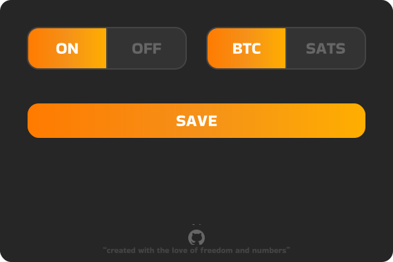
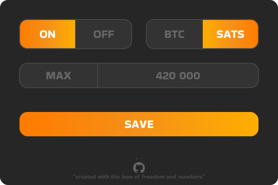
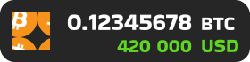
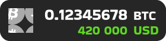
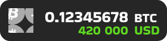
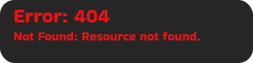

# Bitcointags
Bitcointags is a browser extension that converts the fiat price of a product or service within a selected HTML entity into an approximate bitcoin price.

- **Use case**
    - Many e-shops do not yet accept payments in bitcoins, and if they do, most do not display the price of the product or service in bitcoins. For this reason, the Bitcointags project was created.

- **Disclaimer**
    - The price returned by Bitcointags is indicative only. The exchange rate is constantly changing and bitcoin does not have a uniform price. Therefore, the price may vary when the e-shop is billed!


## Table of Contents
- [Coming soon...](#coming-soon)
- [License](#license)
- [Installation](#installation)
    - [Mozila Firefox](#mozila-firefox)
    - [Chromium browsers](#chromium-browsers)
- [Interface description](#interface-description)
    - [GUI](#gui-description)
    - [Tag](#tag-description)
- [FAQ](#faq)
- [Sources](#sources)
- [Acknowledgements](#acknowledgements)


## Coming soon...
- Fix text editing bug in isCurrency algorithm.
- Complete extensive documentation.
- Select&convert mode.
- It tells you whether the e-shop accepts bitcoins.


## License
Bitcointags is licensed under the MIT license. The full text of the license can be found [here](./LICENSE.md). For more information, please visit [Wikipedia - MIT License](https://en.wikipedia.org/wiki/MIT_License).


## Installation
Bitcointags are available for browsers with the [**Chromium core**](https://www.chromium.org) (Google Chrome, Microsoft Edge, Opera...) and [**Mozilla Firefox**](https://www.mozilla.org/en-US/firefox).

You can add Bitcointags for **Firefox** via the **official Mozila add-ons** or as a **temporary add-on**. Bitcointags is **not yet available** in the [Chrome Web Store](https://chromewebstore.google.com/) and I **won't personally add** Bitcointags to the Chrome Web Store. The reason can be found in the [FAQ](#faq) section. Still, Bitcointags can be added to the Chrome browser using the **developer mode** for Chromium browsers.

To add the Bitcointags extension as a **temporary add-on** or through **developer mode**, you will need the Bitcointags source files. The following guide outlines the steps to download these files and modify them for use in your browser.

#### 1. Source files installation
Click **Code** and select **Download ZIP** or use the command line with [Git](https://git-scm.com/).

```
git clone https://github.com/warezoid/bitcointags.git
```

#### 2. Source files modification
**Unzip the downloaded file.** Then open it and **delete** or **move** folders and files to get the following structure.

```
src/
    img/
    mainfest.json
    BakbakOne-Regular.ttf
    popup.html
    popup.js
    script.js  
    style.css
```

**Notes**
- Select the manifest according to your browser type.
- Do not delete any files or folders in **img** folder.


### Mozila Firefox
You can add Bitcointags for **Firefox** via the **official Mozila add-ons** or as a **temporary add-on**.

#### Mozila Add-ons
Add Bitcointags via **[this](https://addons.mozilla.org/addon/bitcointags/)** link or search for ***"Bitcointags"*** in **[Mozilla Add-ons](https://addons.mozilla.org)**.

#### Temporary add-on
To add a temporary add-on, follow the **[official documentation](https://extensionworkshop.com/documentation/develop/temporary-installation-in-firefox/#Using_the_command_line)**.

**Notes**
- The temporary add-on will only be in Firefox until you **delete** it or **turn off the browser**. 
- If you have **successfully loaded** the temporary add-on to Firefox, but Bitcointags is **not responding**. Check if you have **enabled** Bitcointags to **[run in private windows](https://support.mozilla.org/en-US/kb/extensions-private-browsing).**


### Chromium browsers
Bitcointags is **not yet available** in the [Chrome Web Store](https://chromewebstore.google.com/) and I **won't personally add** Bitcointags to the Chrome Web Store. The reason can be found in the [FAQ](#faq) section. Still, Bitcointags can be added to the Chrome browser using the **developer mode** for Chromium browsers.

I decided to include a link to the official instructions for [loading the unpacked extension](https://developer.chrome.com/docs/extensions/get-started/tutorial/hello-world#load-unpacked) into Google Chrome. With a few exceptions, the procedure is almost identical for browsers running the Chromium kernel.

#### 1. Extensions window
Open your browser and in the address bar type:

```
<your_browser>://extensions
```

A few examples:

```
chrome://extensions
edge://extensions
opera://extensions
```


#### 2. Developer mode
Find **Developer mode** and if it is not activated, activate it.

#### 3. Adding Bitcointags
After that click the **Load unpacked** button and select the **src** folder you downloaded and edited earlier.

#### 4. Bitcointags for Chromium browsers is ready to use.


## Interface description.
This section focuses on describing **graphical user interface (GUI)** and **tag** in Bitcointags project.

### GUI description
The Graphical User Interface (GUI) is a **extension popup** that is used to **customize Bitcointags**. The description of the GUI focuses only on the **main part**, not on loading and status display. You can see the **GUI** below.



**On/Off button**
The on/off button is used to **activate and deactivate Bitcointags**. When Bitcointags are **disabled**, there is **no listening** on the page or **calling the CoinCap API 2.0**, so **Bitcointags are not active**.



**BTC/sats button**
The BTC/sats button determines whether the **resulting price** returned by Bitcointags is displayed in **bitcoins or satoshi**. **Satoshi** is a **subunit of bitcoin**, specifically **one hundred millionth of a bitcoin**.


**Maximum satoshi textbox**
The value in the textbox specifies the **amount of satoshi** at which the **price returned by Bitcointags** will be **displayed in satoshi** when **satoshi mode is enabled**. If the price **exceeds** this amount, it will be **displayed in bitcoins**. The user can set an **integer** from **1 to 999,999,999**. This setting prevents **incorrect formatting of the tag**. The default value is **9,999,999 satoshi**.


**Save button**
The Save button is used to **save the new settings**.


**Github logo**
Clicking on the GitHub logo will **redirect you** to the Bitcointags **repository on GitHub**.


### Tag description
A "tag" is an HTML element that the Bitcointags application adds to a page. Tags usually have two basic appearances: **normal** and **error**. The "Loading" tag is not included in this description.

#### Normal tag
The **normal tag** is displayed if everything is running fine, or if an error occurs during an CoinCap API 2.0 call but the program already has older API data. You can see the **normal tag** below.



**Logo**
The Bitcoin logo symbolizes the **timeliness** of the data. If the logo **turns grey**, it means that the Bitcointags app is **not currently working** with the **current bitcoin price** or **fiat currency exchange rates**. However, the **program still works**.



**Price of goods**
The **amount of bitcoins or satoshi** (bitcoin subunit) represents the **price of the good or service** for which you have **activated the Bitcointags program**. Whether the price is shown in bitcoins or satoshi depends on your **Bitcointags settings**.


**Bitcoin price**
The bitcoin price shows the **current value of bitcoin** from which the **price of a good or service** has been **calculated**. The **colour of the indicator** is based on the **movement of the bitcoin price** over the last 24 hours. If the price is **red**, it means that bitcoin has **fallen** in the last 24 hours. If the price is **green**, bitcoin has **risen** over the same period.



#### Error tag
If the **CoinCap API 2.0 response** is empty, an **error** tag will be displayed. This indicates that an error occurred when the **API was first called**. Please refer to the [Errors](docs/DOCUMENTATION.md#errors) section of the [documentation](docs/DOCUMENTATION.md) for a more detailed explanation of this issue. You can see the **error tag** below.


**Error code**
Error code is the **HTTP status code** returned by the **CoinCap API 2.0**. For more information on status codes, please visit the [CoinCap API 2.0 documentation](https://docs.coincap.io). For details on the use of status codes in Bitcointags, see the [Errors](#errors) section of the [documentation](docs/DOCUMENTATION.md).


**Error message**
Error message is a **short description** of the error. The message should help in **troubleshooting**.





## FAQ
- ***Something I would like to change about Bitcointags. What about it?***
    - I'd like the project to evolve with community involvement over time. That's why I'm open to collaboration, discussions, adding new features and so on. If you have ideas, questions or anything you would like to contribute or discuss regarding Bitcointags, feel free to share them in the discussion.

- ***I found a bug, what should I do?***
    - If you find or have found a bug, I and perhaps the future community would certainly appreciate it if you let us know about it. You can do so in the **Issues** tab. If you have found a solution to the bug, feel free to share it.

- ***Why aren't Bitcointags in the Chrome Web Store?***
    - For admission to the Developer program, age verification is required. However, I decline to submit personal documents to Google, and therefore choose not to enroll in the Developer program. Both I and the community would certainly appreciate if a publisher could be found to keep the Bitcointags in the Chrome Web Store up to date.

- ***Why Bitcointags doesn't have a light mode?***
    - I couldn't come up with a ligth mode design that I liked enough.

- ***The GUI got stuck when loading an animation. What should I do?***
    - If you have migrated from version 1.1.14 or earlier to version 1.1.15 or later, you may experience the problem listed above. The solution is to type the "clearsync" when you launch the GUI. If the operation is successful, the loading animation will complete and the window will close automatically. After restarting, the application should work properly. You can use this procedure at any time, but keep in mind that it will clear the synchronized storage, which will result in the loss of your settings for Bitcointags. 

## Sources
Sources can be seen as links to products used in Bitcointags, including APIs, graphics, research tools, and of course Bitcoin, without which this project and many others would not exist. I have chosen not to list elementary products such as HTML, CSS, JavaScript, and many others.

- **Graphics**
    - Bitcoin - logo and product as a whole: [bitcoin.org](https://bitcoin.org)
    - Github - logo and space for collaboration: [github.com](https://github.com)
    - Icons8 - colourful github logo: [icons8.com](https://icons8.com)
    - Google Fonts - font used in Bitcointags: [fonts.google.com](https://fonts.google.com/)
        - Bakbak One - specific font used in Bitcointags: [Bakbak One - Google Fonts](https://fonts.google.com/specimen/Bakbak+One?query=Bakbak+one)
    - Figma - Bitcointags design: [figma.com](https://www.figma.com)
    - Other graphical elements used in the Bitcointags project, such as alert and checkmark icon, along with all Bitcointags logos, are also licensed under the [MIT license](https://en.wikipedia.org/wiki/MIT_License) and are free to use.

- **APIs**
    - Coincap API 2.0 - used to get the price of bitcoin and rate of fiat currencies: [docs.coincap.io](https://docs.coincap.io)
    - Web Crypto API - used to calculate the checksum: [www.w3.org/TR/WebCryptoAPI](https://www.w3.org/TR/WebCryptoAPI)
    - Chrome APIs
        - Storage API - used to save the user profile: [developer.chrome.com](https://developer.chrome.com/docs/extensions/reference/api/storage)
        - Tabs API - used for communication between popup and background script: [developer.chrome.com](https://developer.chrome.com/docs/extensions/reference/api/tabs)
        - Runtime API - used for communication between popup and background script: [developer.chrome.com](https://developer.chrome.com/docs/extensions/reference/api/runtime)

- **Research tools**
    - ChatGPT: [chatgpt.com](https://chatgpt.com)
    - Stack Overflow: [stackoverflow.com](https://stackoverflow.com)
    - DeepL: [deepl.com](https://www.deepl.com)
    - And the internet itself.


## Acknowledgements
I would like to thank my friends for their help in developing Bitcointags, whether it be through advice, design choices or sharing their opinions. And, of course, to Satoshi Nakamoto for Bitcoin, a project that opened the door to a world of possibilities and financial freedom. We are all Satoshi. :star:


###### Created by warezoid with the love of freedom and numbers.