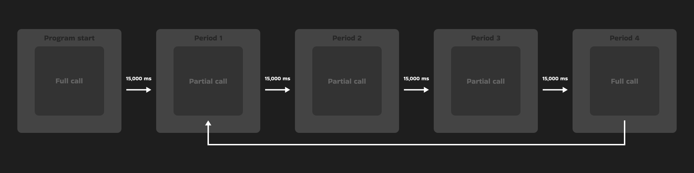

# Bitcointags documentation


## Abstract
This document describes the technically key parts of the Bitcointags program. I have tried to select parts that might cause confusion for other developers when developing Bitcointags. An [overview of contents](#table-of-contents) can be found below. For practical information, the [README.md](../README.md) file can be visited.

## Table of Contents
- [Introduction](#introduction)
- [Terminology](#terminology)
- [Functional Principles](#functional-principles)
    - [Supported currencies](#supported-currencies)
- [Sources](#sources)
- [Acknowledgements](#acknowledgements)


## Introduction


## Terminology
- **Tag**: HTML element that Bitcointags adds to the page. You can see the tag below.


## Functional Principles

### Supported currencies.
When Bitcointags is run, variables are initialized and declared. One of these variables is an array of currencies that Bitcointags supports. Below you can find a list of these currencies.

**Supported currencies: *US dollar (USD), Czech koruna (CZK), euro (EUR), Japanese yen (JPY), British pound (GBP).***

The supported currencies were carefully selected to make Bitcointags as globally compatible as possible, while avoiding collisions and not overloading the program unnecessarily.

Presented below is the code that initializes and declares the "**currencies**" variable.

```javascript
const currencies = [
    {ticker: "btc", apiCode: "bitcoin", symbol: ["btc", "₿", "bitcoin", "satoshi", "sat", "sats"]},
    {ticker: "usd", apiCode: "united-states-dollar", symbol: ["usd", "$", "usdollar", "unitedstatesdollar"]},
    {ticker: "czk", apiCode: "czech-republic-koruna", symbol: ["czk", "kč", ",-", "czechkoruna", "czechcrown"]},
    {ticker: "eur", apiCode: "euro", symbol: ["eur", "€", "euro"]},
    {ticker: "jpy", apiCode: "japanese-yen", symbol: ["jpy", "¥", "yen"]},
    {ticker: "gbp", apiCode: "british-pound-sterling", symbol: ["gbp", "£", "pound", "britishpound"]}
]


//script.js line 365
```

"**Currencies**" is an array of objects. Each object represents an individual currency, structured as follows:

```
{ticker, apiCode, symbol}
```

"**Ticker**" serves as a unique id of the currency and also passes its value to the "**currency**" variable, which is further used by Bitcointags.

"**Apicode**" is a currency id according to the *CoinCap standard*. By adding this variable to the URL to which a GET request is sent, information about different currencies can be obtained. For more information about the CoinCap API, please see their [official documentation](https://docs.coincap.io) or the "[Getting the financial data](#getting-the-financial-data)" section.

"**Symbol**" is an array of strings that represent the potential display of a currency on a page.


### Getting the financial data.
Bitcointags uses REST API technology for [CoinCap API 2.0](https://docs.coincap.io) calls, which is based on HTTP requests. Bitcointags only uses HTTP GET requests. Data is returned in JSON format.

Bitcointags calls the CoinCap API 2.0 at regular intervals to get informations about the price of bitcoin and the exchange rates of the fiat currencies it supports.

Below you can find the structure of the data that Bitcointags get from the CoinCap API 2.0 call.

```
{
    btc: {
        change,
        price,
        statusCode
    },
    fiat: [{currency, rate, statusCode}, ...]
}
```

When the Bitcointags program is run, a data variable with the above structure is initialized and declared. It stores the data obtained from the CoinCap API 2.0. You can see the initialization and declaration of this variable below.

```javascript
let data = {
    btc: {
        change: null,
        price: null,
        statusCode: null
    },
    fiat: []
}


//script.js line 380
```


#### Data from Various Endpoints
Bitcointags uses two different CoinCap API 2.0 endpoints. From one endpoint it gets bitcoin price information, while from the other endpoint it gets fiat currency data. The two endpoints and the types of data that can be retrieved from them are described below.

**Bitcoin price data**
The bitcoin price information is obtained from the *assets/bitcoin* endpoint. The specific data and its description are given below.

```
{change, price, statusCode}
```

"**Change**" represents the percentage movement in the value of bitcoin over the last 24 hours. This is used when displaying the *tag* on the page.

"**Price**" indicates the current price of bitcoin in US dollars. This is used when calculating the price of an item and when displaying the *tag* on the page.

"**Status code**" is the HTTP status code returned by the CoinCap API 2.0. This code is used when displaying a *tag*, either normal or error. For more information on status codes, please visit the [CoinCap API 2.0 documentation](https://docs.coincap.io). For details on the use of status codes in Bitcointags, see the [Errors](#errors) section.

**Fiat price data**
Information about fiat currencies is obtained from the *rates/"CURRENCY_ID"* endpoint. Currency IDs are contained in the **apiCode** variable for each currency supported by Bitcointags. We would choose the endpoint *rates/euro* to call the CoinCap API 2.0 to get information about euros. The specific details and their description are given below.

```
{currency, rate, statusCode}
```

"**Currency**" represents the ticker symbol of the called currency. It serves as a unique id for the currency and is displayed when the *tag* is listed on the page. It is derived from the *Ticker* variable in the [Supported currencies section](#supported-currencies).

"**Rate**" stores the rate between the US Dollar and the called currency. This rate is used when calculating the price if it is not in US dollars.

"**Status code**" is the HTTP status code returned by the CoinCap API 2.0. This code is used when displaying a *tag*, either normal or error. For more information on status codes, please visit the [CoinCap API 2.0 documentation](https://docs.coincap.io). For details on the use of status codes in Bitcointags, see the [Errors](#errors) section.


#### Periodic API Calls
The interval between calls to the api interface is 15,000 ms (15 s). Once upon 60,000 ms (1 min) there is a full API call, which call all currencies. For a better understanding, the diagram below can be used.



Below is a diagram converted into code.

```javascript
const apiCall = async () => {
    let period = 0
    
    await fullCall()

    apiCallInterval = setInterval(() => {
        period++

        if(period >= 4){  
            fullCall()

            period = 0
            return
        }
        
        partialCall()
    }, 15000)

    document.addEventListener("mouseover", mouseOver)
    window.addEventListener("mouseout", mouseOut)
}


//script.js line 385
```


The main difference between *fullCall* and *partialCall* is in obtaining information about fiat currencies. The CoinCap API 2.0 call logic code for obtaining bitcoin financial information is shown below.

In the place marked with a comment, the two functions make different API calls to get information about fiat currencies. The main differences are the number of CoinCap API 2.0 calls and the different error logic. More about these differences can be found below.

```javascript
const fullCall = async () => {
    try{
        let usdResponse = await fetch(`https://api.coincap.io/v2/assets/bitcoin`)

        if(usdResponse.status == 200){
            let dataApi = await usdResponse.json()

            data.btc = {
                change: dataApi.data.changePercent24Hr,
                price: dataApi.data.priceUsd,
                statusCode: usdResponse.status
            }
                        
            //calling CoinCap API 2.0 for informations on fiat currencies...

            return 
        }   

        data.btc.statusCode = usdResponse.status

    }catch(err){
        data.btc.statusCode = 999
    }
}


//script.js line 414
```

**Full call**
FullCall is called once per minute and is considered the main CoinCap API 2.0 call. It has the functionality to capture and pass information about the occurrence of an error and retrieves financial information about all currencies by cycling CoinCap API 2.0 calls for each currency in the *[list of currencies](#supported-currencies)* separately. Below you will find the code to call for information on fiat currencies.

```javascript
let workingArray = []
            
for(let i = 2; i < currencies.length; i++){
    let statusCode = 200
    
    try{
        let fiatResponse = await fetch(`https://api.coincap.io/v2/rates/${currencies[i].apiCode}`)

        if(fiatResponse.status == 200){
            dataApi = await fiatResponse.json()

            workingArray.push({currency: currencies[i].ticker, rate: dataApi.data.rateUsd, statusCode})

            continue
        }
        
        statusCode = fiatResponse.status
    }catch(err) {
        statusCode = 999
    }

    workingArray.push({currency: currencies[i].ticker, rate: null, statusCode})
}

setData(workingArray)


//script.js line 428
```

**Partial call**
The *partialCall* is made every 15 seconds and is considered a CoinCap API 2.0 update call. Errors are intentionally ignored and wait for the *fullCall* error to be acknowledged. If *fullCall* logs an error but *partialCall* goes through fine, the program discards the error and continues.

Only the preferred currency is called from the currency list. This is the currency that was last used on the page when Bitcointags succeeded. It is assumed that there will not be multiple currencies on a single page. If there are multiple currencies on a page, Bitcointags handles this by using values from *fullCall* that are at most a minute old.

Below you will find the code to call the fiat currency information in *partialCall*.

```javascript
if(preferredCurrency != ""){
    let x = data.fiat.findIndex(c => c.currency == preferredCurrency)
    let y = currencies.findIndex(c => c.ticker == preferredCurrency)

    if(x > -1){
        try{
            let fiatResponse = await fetch(`https://api.coincap.io/v2/rates/${currencies[y].apiCode}`)

            if(fiatResponse.status == 200){
                dataApi = await fiatResponse.json()

                data.fiat[x].rate = dataApi.data.rateUsd
                data.fiat[x].statusCode = fiatResponse.status

                return
            }
        }catch(err) {

        }
    }
}


//script.js line 496
```


**Note**
At the same time, when the CoinCap API 2.0 is called for the first time, the event listener are pinned to the window and document, which are important for the further functioning of Bitcointags. The first listener is described in more detail in the [DOM structure monitoring](#dom-structure-monitoring) section. The second listener, which responds to the mouse leaving the page, triggers a function that renders the tag invisible from the page.


### DOM structure monitoring.


### Communication and data manipulation.
Saving and loading data.
Communication between content scripts and popup.

### Algorithms.
isCurrency algorithm.
getAmount algorithm.

### Errors.

### GUI.
Display tag.
Loading animation.
Switching scenes.


## Sources
Sources can be seen as links to products used in Bitcointags, including APIs, graphics, research tools, and of course Bitcoin, without which this project and many others would not exist. I have chosen not to list elementary products such as HTML, CSS, JavaScript, and many others.

- **Graphics**
    - Bitcoin - logo and product as a whole: [bitcoin.org](https://bitcoin.org)
    - Github - logo and space for collaboration: [github.com](https://github.com)
    - Icons8 - colourful github logo: [icons8.com](https://icons8.com)
    - Google Fonts - font used in Bitcointags: [fonts.google.com](https://fonts.google.com/)
        - Bakbak One - specific font used in Bitcointags: [Bakbak One - Google Fonts](https://fonts.google.com/specimen/Bakbak+One?query=Bakbak+one)
    - Figma - Bitcointags design: [figma.com](https://www.figma.com)
    - Other graphical elements used in the Bitcointags project, such as alert and checkmark icon, along with all Bitcointags logos, are also licensed under the [MIT license](https://en.wikipedia.org/wiki/MIT_License) and are free to use.

- **APIs**
    - CoinCap API 2.0 - used to get the price of bitcoin and rate of fiat currencies: [docs.coincap.io](https://docs.coincap.io)
    - Web Crypto API - used to calculate the checksum: [www.w3.org/TR/WebCryptoAPI](https://www.w3.org/TR/WebCryptoAPI)
    - Chrome APIs
        - Storage API - used to save the user profile: [developer.chrome.com](https://developer.chrome.com/docs/extensions/reference/api/storage)
        - Tabs API - used for communication between popup and background script: [developer.chrome.com](https://developer.chrome.com/docs/extensions/reference/api/tabs)
        - Runtime API - used for communication between popup and background script: [developer.chrome.com](https://developer.chrome.com/docs/extensions/reference/api/runtime)

- **Research tools**
    - ChatGPT: [chatgpt.com](https://chatgpt.com)
    - Stack Overflow: [stackoverflow.com](https://stackoverflow.com)
    - DeepL: [deepl.com](https://www.deepl.com)
    - And the internet itself.


## Acknowledgements
I would like to thank my friends for their help in developing Bitcointags, whether it be through advice, design choices or sharing their opinions. And, of course, to Satoshi Nakamoto for Bitcoin, a project that opened the door to a world of possibilities and financial freedom. We are all Satoshi. :star:


###### Created by warezoid with the love of freedom and numbers.