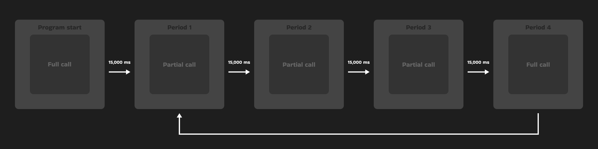

# Bitcointags documentation


## Abstract
This document describes the technically key parts of the Bitcointags program. I have tried to select parts that might cause confusion for other developers when developing Bitcointags. An [overview of contents](#table-of-contents) can be found below. For practical information, the [README.md](../README.md) file can be visited.

## Table of Contents
- [Introduction](#introduction)
- [Contact](#contact)
- [Terminology](#terminology)
- [Functional Principles](#functional-principles)
    - [Supported currencies](#supported-currencies)
    - [Getting the financial data](#getting-the-financial-data)
        - [Data from Various Endpoints](#data-from-various-endpoints)
        - [Periodic API Calls](#periodic-api-calls)
    - [DOM structure monitoring](#dom-structure-monitoring)
        - [Mouseover](#mouseover)
        - [Mouseout](#mouseout)
        - [Mouseleave](#mouseleave)
        - [Mousemove](#mousemove)
    - [Data manipulation](#data-manipulation)
        - [Saving data and intercommunication](#saving-data-and-intercommunication)
            - [SaveConfig function](#saveconfig-function)
        - [Loading data](#loading-data)
            - [Content script](#content-script)
            - [GUI](#gui)
    - [Algorithms](#algorithms)
        - [IsCurrency](#iscurrency)
- [Sources](#sources)
- [Acknowledgements](#acknowledgements)


## Introduction

## Contact


## Terminology
- **Tag**: HTML element that Bitcointags adds to the page. You can see the tag below.
- **DOM (Document object model)**: Structured tree model of the document, where each element of the document is represented as an object. For more information, you can visit [Document Object Model](https://wikipedia.org/wiki/Document_Object_Model) on [Wikipedia](https://wikipedia.org).
- **GUI (Graphical User Interface)**: In the context of Bitcointags, the GUI can be understood as the extension's popup window.
- **Content scripts**: A file that runs in the context of a web page. In the context of Bitcointags, a content script can be thought of as a **script.js** file, which is the core of Bitcointags.


## Functional Principles

### Supported currencies.
When Bitcointags is run, variables are initialized and declared. One of these variables is an array of currencies that Bitcointags supports. Below you can find a list of these currencies.

**Supported currencies: *US dollar (USD), Czech koruna (CZK), euro (EUR), Japanese yen (JPY), British pound (GBP).***

The supported currencies were carefully selected to make Bitcointags as globally compatible as possible, while avoiding collisions and not overloading the program unnecessarily.

Presented below is the code that initializes and declares the "**currencies**" variable.

```javascript
const currencies = [
    {ticker: "btc", apiCode: "bitcoin", symbol: ["btc", "₿", "bitcoin", "satoshi", "sat", "sats"]},
    {ticker: "usd", apiCode: "united-states-dollar", symbol: ["usd", "$", "usdollar", "unitedstatesdollar"]},
    {ticker: "czk", apiCode: "czech-republic-koruna", symbol: ["czk", "kč", ",-", "czechkoruna", "czechcrown"]},
    {ticker: "eur", apiCode: "euro", symbol: ["eur", "€", "euro"]},
    {ticker: "jpy", apiCode: "japanese-yen", symbol: ["jpy", "¥", "yen"]},
    {ticker: "gbp", apiCode: "british-pound-sterling", symbol: ["gbp", "£", "pound", "britishpound"]}
]


//script.js line 365
```

"**Currencies**" is an array of objects. Each object represents an individual currency, structured as follows:

```
{ticker, apiCode, symbol}
```

"**Ticker**" serves as a unique id of the currency and also passes its value to the "**currency**" variable, which is further used by Bitcointags.

"**Apicode**" is a currency id according to the *CoinCap standard*. By adding this variable to the URL to which a GET request is sent, information about different currencies can be obtained. For more information about the CoinCap API, please see their [official documentation](https://docs.coincap.io) or the "[Getting the financial data](#getting-the-financial-data)" section.

"**Symbol**" is an array of strings that represent the potential display of a currency on a page.


### Getting the financial data.
Bitcointags uses REST API technology for [CoinCap API 2.0](https://docs.coincap.io) calls, which is based on HTTP requests. Bitcointags only uses HTTP GET requests. Data is returned in JSON format.

Bitcointags calls the CoinCap API 2.0 at regular intervals to get informations about the price of bitcoin and the exchange rates of the fiat currencies it supports.

Below you can find the structure of the data that Bitcointags get from the CoinCap API 2.0 call.

```
{
    btc: {
        change,
        price,
        statusCode
    },
    fiat: [{currency, rate, statusCode}, ...]
}
```

When the Bitcointags program is run, a data variable with the above structure is initialized and declared. It stores the data obtained from the CoinCap API 2.0. You can see the initialization and declaration of this variable below.

```javascript
let data = {
    btc: {
        change: null,
        price: null,
        statusCode: null
    },
    fiat: []
}


//script.js line 380
```


#### Data from Various Endpoints
Bitcointags uses two different CoinCap API 2.0 endpoints. From one endpoint it gets bitcoin price information, while from the other endpoint it gets fiat currency data. The two endpoints and the types of data that can be retrieved from them are described below.

**Bitcoin price data**
The bitcoin price information is obtained from the *assets/bitcoin* endpoint. The specific data and its description are given below.

```
{change, price, statusCode}
```

"**Change**" represents the percentage movement in the value of bitcoin over the last 24 hours. This is used when displaying the *tag* on the page.

"**Price**" indicates the current price of bitcoin in US dollars. This is used when calculating the price of an item and when displaying the *tag* on the page.

"**Status code**" is the HTTP status code returned by the CoinCap API 2.0. This code is used when displaying a *tag*, either normal or error. For more information on status codes, please visit the [CoinCap API 2.0 documentation](https://docs.coincap.io). For details on the use of status codes in Bitcointags, see the [Errors](#errors) section.

**Fiat price data**
Information about fiat currencies is obtained from the *rates/"CURRENCY_ID"* endpoint. Currency IDs are contained in the **apiCode** variable for each currency supported by Bitcointags. We would choose the endpoint *rates/euro* to call the CoinCap API 2.0 to get information about euros. The specific details and their description are given below.

```
{currency, rate, statusCode}
```

"**Currency**" represents the ticker symbol of the called currency. It serves as a unique id for the currency and is displayed when the *tag* is listed on the page. It is derived from the *Ticker* variable in the [Supported currencies section](#supported-currencies).

"**Rate**" stores the rate between the US Dollar and the called currency. This rate is used when calculating the price if it is not in US dollars.

"**Status code**" is the HTTP status code returned by the CoinCap API 2.0. This code is used when displaying a *tag*, either normal or error. For more information on status codes, please visit the [CoinCap API 2.0 documentation](https://docs.coincap.io). For details on the use of status codes in Bitcointags, see the [Errors](#errors) section.


#### Periodic API Calls
The interval between calls to the api interface is 15,000 ms (15 s). Once upon 60,000 ms (1 min) there is a full API call, which call all currencies. For a better understanding, the diagram below can be used.



Below is a diagram converted into code.

```javascript
const apiCall = async () => {
    let period = 0
    
    await fullCall()

    apiCallInterval = setInterval(() => {
        period++

        if(period >= 4){  
            fullCall()

            period = 0
            return
        }
        
        partialCall()
    }, 15000)

    document.addEventListener("mouseover", mouseOver)
    window.addEventListener("mouseout", mouseOut)
}


//script.js line 385
```


The main difference between *fullCall* and *partialCall* is in obtaining information about fiat currencies. The CoinCap API 2.0 call logic code for obtaining bitcoin financial information is shown below.

In the place marked with a comment, the two functions make different API calls to get information about fiat currencies. The main differences are the number of CoinCap API 2.0 calls and the different error logic. More about these differences can be found below.

```javascript
const fullCall = async () => {
    try{
        let usdResponse = await fetch(`https://api.coincap.io/v2/assets/bitcoin`)

        if(usdResponse.status == 200){
            let dataApi = await usdResponse.json()

            data.btc = {
                change: dataApi.data.changePercent24Hr,
                price: dataApi.data.priceUsd,
                statusCode: usdResponse.status
            }
                        
            //calling CoinCap API 2.0 for informations on fiat currencies...

            return 
        }   

        data.btc.statusCode = usdResponse.status

    }catch(err){
        data.btc.statusCode = 999
    }
}


//script.js line 414
```

**Full call**
FullCall is called once per minute and is considered the main CoinCap API 2.0 call. It has the functionality to capture and pass information about the occurrence of an error and retrieves financial information about all currencies by cycling CoinCap API 2.0 calls for each currency in the *[list of currencies](#supported-currencies)* separately. Below you will find the code to call for information on fiat currencies.

```javascript
let workingArray = []
            
for(let i = 2; i < currencies.length; i++){
    let statusCode = 200
    
    try{
        let fiatResponse = await fetch(`https://api.coincap.io/v2/rates/${currencies[i].apiCode}`)

        if(fiatResponse.status == 200){
            dataApi = await fiatResponse.json()

            workingArray.push({currency: currencies[i].ticker, rate: dataApi.data.rateUsd, statusCode})

            continue
        }
        
        statusCode = fiatResponse.status
    }catch(err) {
        statusCode = 999
    }

    workingArray.push({currency: currencies[i].ticker, rate: null, statusCode})
}

setData(workingArray)


//script.js line 428
```

**Partial call**
The *partialCall* is made every 15 seconds and is considered a CoinCap API 2.0 update call. Errors are intentionally ignored and wait for the *fullCall* error to be acknowledged. If *fullCall* logs an error but *partialCall* goes through fine, the program discards the error and continues.

Only the preferred currency is called from the currency list. This is the currency that was last used on the page when Bitcointags succeeded. It is assumed that there will not be multiple currencies on a single page. If there are multiple currencies on a page, Bitcointags handles this by using values from *fullCall* that are at most a minute old.

Below you will find the code to call the fiat currency information in *partialCall*.

```javascript
if(preferredCurrency != ""){
    let x = data.fiat.findIndex(c => c.currency == preferredCurrency)
    let y = currencies.findIndex(c => c.ticker == preferredCurrency)

    if(x > -1){
        try{
            let fiatResponse = await fetch(`https://api.coincap.io/v2/rates/${currencies[y].apiCode}`)

            if(fiatResponse.status == 200){
                dataApi = await fiatResponse.json()

                data.fiat[x].rate = dataApi.data.rateUsd
                data.fiat[x].statusCode = fiatResponse.status

                return
            }
        }catch(err) {

        }
    }
}


//script.js line 495
```


**Note**
At the same time, when the CoinCap API 2.0 is called for the first time, the event listener are pinned to the window and document, which are important for the further functioning of Bitcointags. The first listener is described in more detail in the [DOM structure monitoring](#dom-structure-monitoring) section. The second listener, which responds to the mouse leaving the page, triggers a function that renders the tag invisible from the page.


### DOM structure monitoring.
Monitoring the DOM structure consists of attaching event listeners to elements, a document, or an entire window and then the behavior of the program when they are triggered.

Event listeners have four basic functions in DOM monitoring. Each of these listeners is described in detail below.

#### Mouseover
The mouseover event listener is activated when the user hovers the mouse cursor over any HTML element on the page. In the context of Bitcointags, this listener calls the [isCurrency algorithm](#iscurrency) on each activation to determine whether the text in the selected element contains a price with the supported currency.

If successful, it triggers the tag generation function and sets up the [mouseleave](#mouseleave) event listener described below.

Successful listing is preceded by several additional steps, which are described below.

```javascript
previousElement = currentElement
currentElement = e.target

if(currentElement && previousElement){
    if(currentElement.innerText != previousElement.innerText){
        if(isCurrency()){
            currentElement.addEventListener("mouseleave", removeTag)

            generateTag()
            return
        }
        
        for(let i = 0; i < 4; i++){
            if(currentElement.parentElement){
                currentElement = currentElement.parentElement

                if(isCurrency()){
                    if(currentElement.innerText != previousElement.innerText){
                        currentElement.addEventListener("mouseleave", removeTag)

                        generateTag()
                    }

                    return
                }
            }
        }
    }
}


//script.js line 543
```

To better understand the code above, the following diagram can be used.


**Element repetition check**
Each time the listener of the mouseover event is activated, the current and previous HTML elements are set to check if they are not the same. This is to ignore the situation where the user moves the mouse cursor in the nested HTML element area. This addresses the repeated display of the tag. This is both a slight optimization and a graphically better solution.

**Problem of sibling elements**
Bitcointags contain a loop that is triggered if the first query of the isCurrency function fails. This loop solves the problem of sibling HTML elements that contain a split price for a product or service. The solution is implemented by a loop that is repeated five times along with the first query of the isCurrency function. With each repetition, the current element is set as the parent element of the previous element, thus gradually ascending the hierarchical structure of the document. The issue can be understood by following the example code below.

```html
<div class="full-price">
    <div class="price">
        <span class="whole-price">9</span>
        <span>.</span>
        <span class="decimal-price">99</span>   <!-- user hover this element -->
    </div>

    <div class="currency">$</div>
</div>


<!-- Demonstration code 1 -->
```


#### Mouseout
The mouseout event listener is attached to the entire window and is used to capture the moment when the user leaves the window they are currently in with the mouse cursor. This event fires the removeTag function mentioned below.


#### Mouseleave
The mouseleave event listener is attached to the current element that has passed the isCurreny algorithm without any problems. This event is triggered when the mouse cursor leaves the current element. When the event listener is activated, the removeTag function is triggered, which sets Bitcointags to the default state. The default state is a state where the tag is not displayed on the page and is set to its original state, while no event listeners are attached to the current element and no refreshTimeout is running.

Below you can find the code of the removeTag function.

```javascript
currentElement.removeEventListener("mousemove", tagMovement)
currentElement.removeEventListener("mouseleave", removeTag)

tag.style.opacity = "0"

clearTimeout(refreshTimeout)

if(document.head.contains(animationStyles)){
    document.head.removeChild(animationStyles)
}

continueLoading = 1

contentContainer.style.opacity = "0"
contentContainer.style.animation = ""

mainContainer.style.opacity = "0"
errorContainer.style.opacity = "0"

loadingContainer.style.opacity = "1"
loadingContainer.style.animation = ""


//script.js line 776
```


#### Mousemove
The mousemove event listener is attached to the current element that passed the isCurrency algorithm. The activation occurs when the user starts moving the mouse cursor on the current element. When this event is fired, the tagMovement function is called, which takes care of moving the tag at the same time as the mouse cursor. At the same time, the tagMovement function makes sure that the tag is not displayed off the page. The tagMovement function can be found below.

```javascript
let transX = 5
let transY = 21

if((e.clientX + 280) > window.innerWidth){
    transX = -105
}

if((e.clientY + 70) > window.innerHeight){
    transY = -121
}

tag.style.transform = `translate(${transX}%, ${transY}%)`

tag.style.left = `${e.pageX}px`
tag.style.top = `${e.pageY}px`


//script.js line 800
```


### Data manipulation.
The data manipulation section describes the process of saving data, retrieving data, and communication between the GUI window and the content script. I decided to combine the subsection on data storage with the subsection on intercommunication mentioned earlier because they are closely related.

The Chrome Storage API is used to store the data. More information about this API can be found in the [official documentation](https://developer.chrome.com/docs/extensions/reference/api/storage).

#### Saving data and intercommunication
The data saving process can only be initiated from the GUI side. It takes place after activating the connected event listener by clicking on the *Save* button shown below, and then checking that the maxSatoshi value is not zero.


Below is the event listener code that activates the saveConfig function, which takes care of saving data and communicating with each other.

```javascript
if(!isZero(input)){   
    formContainer.style.pointerEvents = "none"
    textboxContainer.style.pointerEvents = "none"

    formContainer.style.animation = "replaceContainers 0.5s forwards"
    saveBtn.style.animation = "squeeze 0.5s"

    saveConfig()

    return
}

textboxValue.style.animation = "errorShake 0.2s 2"


//popup.js line 423
```

##### SaveConfig function
The saveConfig function is used for the following operations:

- Saves data with the Bitcointags settings that the user has chosen.
- In real time, it passes information about new data storage to the content script.
- Checksum process.

The diagram below can be used to show the time continuity between the activities.


For better clarity I have decided to describe the individual operations separately.

**Data storage**
Data is stored via the Chrome Storage API. I chose synchronous storage, which unlike local storage is available in all browsers where you are logged in with the same account. For more information, see the official [Chrome Storage API documentation](https://developer.chrome.com/docs/extensions/reference/api/storage).

The data that is stored in the synchronous storage under the *bitcointagsConfig* key is used to modify the tag view. Below is the structure of the object that is stored in the synchronous repository.

```
{btcModeEnable, extensionEnable, maxSatoshi}
```

*ExtensionEnable* affects whether Bitcointags are enabled. *BtcModeEnable* determines whether the converted price in the tag is displayed in bitcoins or satoshi. *MaxSatoshi* specifies the number of satoshi at which the price returned by Bitcointags will be displayed in satoshi if satoshi mode is enabled. For more detailed information about these values, please refer to the [README.md](../README.md) file, specifically the [GUI description](../README.md#gui-description) subsection.

Below is the code that creates and saves the data object to the synchronous storage.

```javascript
let obj = {
    btcModeEnable,
    extensionEnable,
    maxSatoshi: toBtc(input)
}

chrome.storage.sync.set({"bitcointagsConfig": obj}, () => {
    //intercommunication and checksum process code...
})


//popup.js line 439
```

**Intercommunication**
Intercommunication can be understood as the process of exchanging information about newly stored data and data needed for the checksum process between the GUI and the content script.

The GUI initiates the communication by sending a message to the content script using the Chrome Tabs API about the newly saved data. The content script receives the message and retrieves the current data from the synchronous storage. This is followed by the data update process, which is described in more detail in the [Loading data](#loading-data) section, and the checksum process, which is described below.

The code that initiates the intercommunication is also found below and follows the data storage code above.

```javascript
chrome.tabs.query({active: true, currentWindow: true}).then((tab) => {
    chrome.tabs.sendMessage(tab[0].id, "dataSaved", (response) => {
        //checksum process code...
    })
})


//popup.js line 447
```

The following code receives the message, reads the current data and starts the checksum process.

```javascript
chrome.runtime.onMessage.addListener((message, sender, sendResponse) => {
    if(message == "dataSaved"){
        chrome.storage.sync.get(["bitcointagsConfig"], (response) => {     
            config = response.bitcointagsConfig
            
            //checksum and data update process...
        })

        return true
    }
})


//script.js line 315
```

**Checksum process**
The Checksum process is used to check whether the new data has been correctly stored in the synchronous storage and whether Bitcointags are using the current data.

It works by creating a digital fingerprint of the data object retrieved from the synchronous storage after receiving a message about the newly stored data and comparing it with the digital fingerprint of the data that was stored in the synchronous storage before the message was sent. Digital fingerprint in this context means the output of the SHA-1 hashing function, hereafter referred to as *hash*. To create the hash, the *getHash* function is called, which is part of both the GUI and the content script.

Below you can find the code of the *getHash* function.

```javascript
let inputBuffer = new TextEncoder().encode(input)

return crypto.subtle.digest("SHA-1", inputBuffer).then((hash) => {
    window.hash = hash;

    let result = ""
    const view = new DataView(hash)

    for (let i = 0; i < hash.byteLength; i += 4){
        result += ('00000000' + view.getUint32(i).toString(16)).slice(-8)
    }

    return result
})


//script.js line 340, popup.js line 475
```

Hashing is the process of extracting a unique output of a fixed size from data of arbitrary size. The key is that this process is not random, but uses well-defined operations, which means that the same data will always return the same output.

Bitcointags could certainly work without this principle, but as a developer I find it advantageous to work with data that is constant in form and size. I chose the SHA-1 hashing algorithm which, although not the latest and containing collisions, is efficient enough to optimize Bitcointags and meet my needs.

Bitcointags use the Web Crypto API, which you can learn more about in the [official documentation](https://www.w3.org/TR/WebCryptoAPI).

The checksum process starts in the content script after the data is successfully retrieved from the synchronous storage. Below you will find the code that calls the *getHash* function and then sends the output hash in response to a message about the newly saved data to the GUI.

```javascript
getHash(JSON.stringify(config)).then((hash) => {
    sendResponse(hash)
})


//script.js line 322
```

After receiving the response, the GUI calls the *getHash* function, using as input the object that was previously stored in the synchronized storage. It then compares both hashes. If the hashes do not match, an error message is displayed in the GUI. However, Bitcointags continues to operate without error, but works with the data it was using previously.

Below is the code that receives the response, generates a new hash, and then compares both hashes.

```javascript
getHash(JSON.stringify(obj)).then((hash) => {
    if(response == hash){
        processingStatus = 2
    }
    
    continueLoading = 0
})


//popup.js line 449
```


#### Loading data
The data loading section describes the processes of loading data, updating existing data, and the processes that follow. Data loading is done both in the GUI and in the content script. For better clarity, the text is split separately.

Data is stored via the Chrome Storage API. I chose synchronous storage, which unlike local storage is available in all browsers where you are logged in with the same account. For more information, see the official [Chrome Storage API documentation](https://developer.chrome.com/docs/extensions/reference/api/storage).

##### Content script
Data loading in the content script takes place in two places:

- When a message is received about newly saved data.
- When the program is initialized.

Loading data on receipt of the newly saved data message is described above and will not be discussed again in this section. Information not covered above works on the same principle, which will be described below. The following is the code for the function that takes care of retrieving the data when the program is initialized.

```javascript
chrome.storage.sync.get(["bitcointagsConfig"], (response) => {
    let bitcointagsConfig = response.bitcointagsConfig

    if(bitcointagsConfig){
        config = bitcointagsConfig
    }

    if(config.extensionEnable){
        apiCall()
    }
})


//script.js line 303
```

This function calls an object with the *bitcointagsConfig* key in the synchronous storage. On successful retrieval, it sets the *config* variable as a pointer to the retrieved object. The *config* object is the same as the *obj* object described above in [SaveConfig function](#saveconfig-function) section. The following condition eventually calls the *apiCall* function described above in [Periodic API Calls](#periodic-api-calls) section, which activates Bitcointags.

##### GUI
Data loading in the GUI takes place only at one moment, 1000 milliseconds after the program initialization. Part of loading data in the GUI is also setting it to the state in which the user left the GUI. Below is the function that takes care of loading data in the GUI.

```javascript
setTimeout(() => {
    document.head.appendChild(styleElement)

    chrome.storage.sync.get(["bitcointagsConfig"], (response) => {
        let bitcointagsConfig = response.bitcointagsConfig

        if(bitcointagsConfig){
            extensionEnable = bitcointagsConfig.extensionEnable
            btcModeEnable = bitcointagsConfig.btcModeEnable

            input = toSats(bitcointagsConfig.maxSatoshi)
            previousInput = input

            setDefault()
        }
        
        continueLoading = 0
    })
}, 1000)


//popup.js line 345
```

The above function takes care of the seconds interval, which replaces the *DOMContentLoaded* event listener, which I found to be negative. The next step is to call the data, update the existing data, and reset the GUI to its original state using the *setDefault* function.


### Algorithms.
Algorithms in Bitcointags are defined as functions and processes containing advanced logic. Their development was done with versatility in mind, which allows easy implementation of these algorithms in various applications.

#### isCurrency
The isCurrency algorithm determines whether the text value in the current element, if any, contains a currency symbol from the list of supported currencies, or whether it is in a format compatible with Bitcointags.

If the text value passes positive logic, the algorithm returns a logical one, allowing the program to continue. If not, the program does not continue. Therefore, in Bitcointags, the isCurrency algorithm is always called inside a condition.

The value returned by the isCurrency algorithm is also affected by the output of the getAmount function, which is described separately below.

The algorithm is called whenever the listener is activated by the mouseover event described above.

For a better understanding, the diagram below can be used.


Below is the diagram converted into code.

```javascript
let isValid = 0
let fullValue = currentElement?.innerText

if(fullValue){
    fullValue = fullValue.toLowerCase().replace(/\s/g, '')
    let currencyValue = fullValue.replace(/(\d),(\d)|(\d)\.(\d)/g, '$1$3$2$4')

    currencyValue = currencyValue.replace(/[0-9]/g, "")
    fullValue = fullValue.replace(currencyValue, '')

    if(fullValue != "" && !isZero(fullValue)){
        for(let i = 0; i < currencies.length; i++) {
            const { ticker, symbol } = currencies[i];

            if(symbol.includes(currencyValue)){
                if(ticker != "btc"){
                    currency = ticker
                    preferredCurrency = currency
                    ammount = getAmount(fullValue)
                    
                    if(!isNaN(ammount)){
                        isValid = 1
                    }
                }
                else{
                    //???...
                }
    
                return isValid
            }
        }
    }
}

return isValid


//script.js line 575
```


#### getAmount


### Graphic.
#### Display tag
#### Loading animation
#### Switching scenes


### Errors.
The *Errors* section focuses on logging errors and their possible handling in the content script and the graphical user interface (GUI). Also included in the GUI subsection is a description of the [clearStorage method](#clearstorage-method), which removes the *bitcointagsConfig* entry in the synchronous repository and can be used as a workaround when migrating from version 1.1.14 or earlier to version 1.1.15 or later.

#### Content scripts
In the content script, errors are logged to the *statusCode* variable during the API call. This topic is already described above in the [Getting the financial data](#getting-the-financial-data) section and therefore will not be discussed further here.

Error evaluation begins after a successful call to the [isCurrency algorithm](#iscurrency) during tag generation. Two error conditions can occur in the content script. The difference is whether the error occurred during the first API call.

If so, the data from the API was not successfully retrieved, and therefore the values needed to convert the price to bitcoins are not available, resulting in Bitcointags having nothing to display and therefore an error tag. If the error did not occur on the first API call, Bitcointags work with data that was received before the error occurred. They will alert you to this condition by graying out the Bitcoin logo when the tag is displayed.

This logic can be better understood using the following diagram.


Below you can find the code for evaluating the error logic in the *dataCompression* function described above in subsection [Display tag](#display-tag).

```javascript
if(bitcoinValue.price != null){
    if(currency != "usd"){
        if(fiatValue.rate != null){
            obj.statusCode = (bitcoinValue.statusCode + fiatValue.statusCode) / 2
            return obj
        }

        obj.statusCode = fiatValue.statusCode
    }
    
    obj.statusCode = bitcoinValue.statusCode
    return obj
}

obj.statusCode = bitcoinValue.statusCode
return obj


//script.js line 737
```

The initialization of the *statusCode* variable below can be confusing, so I decided to explain it in more detail.

```javascript
obj.statusCode = (bitcoinValue.statusCode + fiatValue.statusCode) / 2


//script.js line 745
```


#### GUI


##### ClearStorage method


## Sources
Sources can be seen as links to products used in Bitcointags, including APIs, graphics, research tools, and of course Bitcoin, without which this project and many others would not exist. I have chosen not to list elementary products such as HTML, CSS, JavaScript, and many others.

- **Graphics**
    - Bitcoin - logo and product as a whole: [bitcoin.org](https://bitcoin.org)
    - Github - logo and space for collaboration: [github.com](https://github.com)
    - Icons8 - colourful github logo: [icons8.com](https://icons8.com)
    - Google Fonts - font used in Bitcointags: [fonts.google.com](https://fonts.google.com/)
        - Bakbak One - specific font used in Bitcointags: [Bakbak One - Google Fonts](https://fonts.google.com/specimen/Bakbak+One?query=Bakbak+one)
    - Figma - Bitcointags design: [figma.com](https://www.figma.com)
    - Other graphical elements used in the Bitcointags project, such as alert and checkmark icon, along with all Bitcointags logos, are also licensed under the [MIT license](https://en.wikipedia.org/wiki/MIT_License) and are free to use.

- **APIs**
    - CoinCap API 2.0 - used to get the price of bitcoin and rate of fiat currencies: [docs.coincap.io](https://docs.coincap.io)
    - Web Crypto API - used to calculate the checksum: [www.w3.org/TR/WebCryptoAPI](https://www.w3.org/TR/WebCryptoAPI)
    - Chrome APIs
        - Storage API - used to save the user profile: [developer.chrome.com](https://developer.chrome.com/docs/extensions/reference/api/storage)
        - Tabs API - used for communication between popup and background script: [developer.chrome.com](https://developer.chrome.com/docs/extensions/reference/api/tabs)
        - Runtime API - used for communication between popup and background script: [developer.chrome.com](https://developer.chrome.com/docs/extensions/reference/api/runtime)

- **Research tools**
    - ChatGPT: [chatgpt.com](https://chatgpt.com)
    - Stack Overflow: [stackoverflow.com](https://stackoverflow.com)
    - DeepL: [deepl.com](https://www.deepl.com)
    - And the internet itself.


## Acknowledgements
I would like to thank my friends for their help in developing Bitcointags, whether it be through advice, design choices or sharing their opinions. And, of course, to Satoshi Nakamoto for Bitcoin, a project that opened the door to a world of possibilities and financial freedom. We are all Satoshi. :star:


###### Created by warezoid with the love of freedom and numbers.